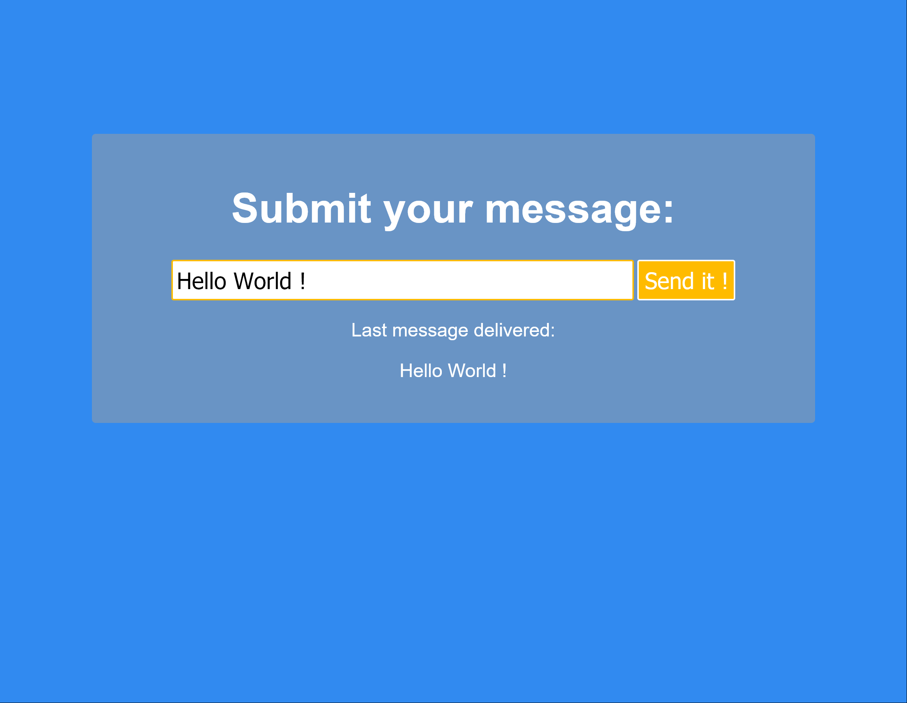

# js-pass-the-message
JS Challenge 4

Exercise 4 from the 100+ Javascript projects page (https://jsbeginners.com/javascript-projects-for-beginners/)

This code takes the text passed in the text field and displays it in the page.

